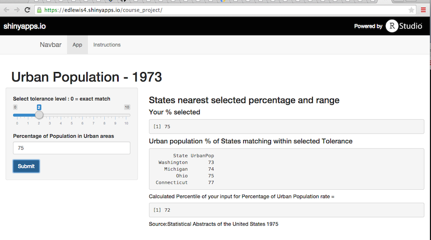

## Urban Population percentages for US States - 1973

- Shiny App to display Urban Population Percentage that match users input within tolerance level
- Returns the US States that are within the tolerance range of the selected Urban population percentage
- Allows for adjustable tolerance level (0 thru 10)
  - 0 equals exact match based on input
  - up to 10 percentages on either end of input value
- Also calculates the Percentile of the users input value
- Uses R Dataset USArrests  -  `data(USArrests)`
  - Source: Statistical Abstracts of the United States 1975
  

--- .class #id 

## The Shiny App for Percentage of Urban Population


- Link to the [Shiny App for Percentage of Urban Population](https://edlewis4.shinyapps.io/course_project/)  
- Screenshot:


--- .class #id


## A look at the code behind the Application
- Sample of the code that determines the states & percentiles with default input at 75 and a tolerance level of 1

```{r }
data(USArrests)
DF <- cbind(State = rownames(USArrests), USArrests)
DF$State <- as.vector(DF$State)

urbanPop_pct <- function(urbanPop,tolerance) {
        matched <- find.matches(DF$UrbanPop,urbanPop,tol=tolerance) 
        matchlogic <- as.logical(matched$matches)
        print(arrange(DF[matchlogic == TRUE,c(1,4)],UrbanPop),row.names=FALSE)
        }
urbanPop_pct(75,1)
```

--- .class #id 


## Google Chart Map
- GoogleCharts map showing the Urban Population Percentage by State
- Hover over a State to see its percentage of Urban Population in 1973

```{r setOptions, echo=FALSE}
options(gvis.plot.tag="chart")
```


```{r echo=FALSE}
library(googleVis)
G <- gvisGeoChart(DF, locationvar = "State", colorvar ="UrbanPop",options = list(width =400, height = 400,region="US", resolution="provinces",backgroundColor="#81d4fa",datalessRegionColor="#f5f5f5"))
```

```{r results='asis', echo=FALSE}
plot(G)
```


