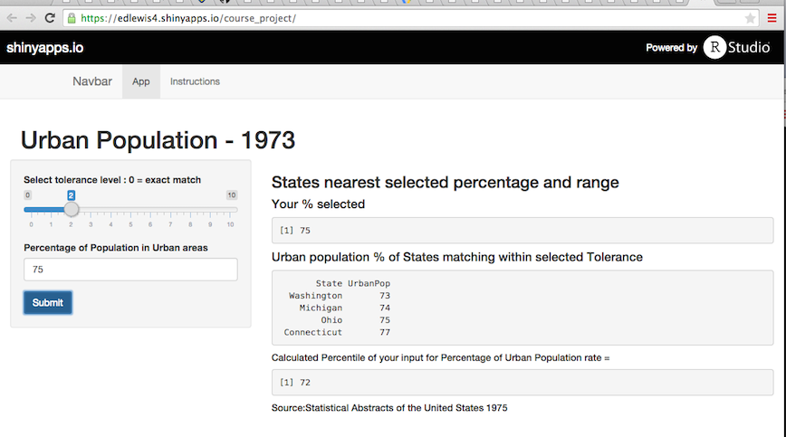

## Urban Population percentages for US States - 1973

- Shiny App to display Urban Population Percentage that match users input within tolerance level
- Returns the US States that are within the tolerance range of the selected Urban population percentage
- Allows for adjustable tolerance level (0 thru 10)
  - 0 equals exact match based on input
  - up to 10 percentages on either end of input value
- Also calculates the Percentile of the users input value
- Uses R Dataset USArrests  -  `data(USArrests)`
  - Source: Statistical Abstracts of the United States 1975
  

--- .class #id 

## The Shiny App for Percentage of Urban Population


- Link to the [Shiny App for Percentage of Urban Population](https://edlewis4.shinyapps.io/course_project/)  
- Screenshot:


--- .class #id


## A look at the code behind the Application
- Sample of the code that determines the states & percentiles with default input at 75 and a tolerance level of 1


```r
data(USArrests)
DF <- cbind(State = rownames(USArrests), USArrests)
DF$State <- as.vector(DF$State)

urbanPop_pct <- function(urbanPop,tolerance) {
        matched <- find.matches(DF$UrbanPop,urbanPop,tol=tolerance) 
        matchlogic <- as.logical(matched$matches)
        print(arrange(DF[matchlogic == TRUE,c(1,4)],UrbanPop),row.names=FALSE)
        }
urbanPop_pct(75,1)
```

```
##     State UrbanPop
##  Michigan       74
##      Ohio       75
```

--- .class #id 


## Google Chart Map
- GoogleCharts map showing the Urban Population Percentage by State
- Hover over a State to see its percentage of Urban Population in 1973


<!-- GeoChart generated in R 3.1.1 by googleVis 0.5.8 package -->
<!-- Sat May 23 18:49:46 2015 -->


<!-- jsHeader -->
<script type="text/javascript">
 
// jsData 
function gvisDataGeoChartID1264217de2c7 () {
var data = new google.visualization.DataTable();
var datajson =
[
 [
 "Alabama",
58 
],
[
 "Alaska",
48 
],
[
 "Arizona",
80 
],
[
 "Arkansas",
50 
],
[
 "California",
91 
],
[
 "Colorado",
78 
],
[
 "Connecticut",
77 
],
[
 "Delaware",
72 
],
[
 "Florida",
80 
],
[
 "Georgia",
60 
],
[
 "Hawaii",
83 
],
[
 "Idaho",
54 
],
[
 "Illinois",
83 
],
[
 "Indiana",
65 
],
[
 "Iowa",
57 
],
[
 "Kansas",
66 
],
[
 "Kentucky",
52 
],
[
 "Louisiana",
66 
],
[
 "Maine",
51 
],
[
 "Maryland",
67 
],
[
 "Massachusetts",
85 
],
[
 "Michigan",
74 
],
[
 "Minnesota",
66 
],
[
 "Mississippi",
44 
],
[
 "Missouri",
70 
],
[
 "Montana",
53 
],
[
 "Nebraska",
62 
],
[
 "Nevada",
81 
],
[
 "New Hampshire",
56 
],
[
 "New Jersey",
89 
],
[
 "New Mexico",
70 
],
[
 "New York",
86 
],
[
 "North Carolina",
45 
],
[
 "North Dakota",
44 
],
[
 "Ohio",
75 
],
[
 "Oklahoma",
68 
],
[
 "Oregon",
67 
],
[
 "Pennsylvania",
72 
],
[
 "Rhode Island",
87 
],
[
 "South Carolina",
48 
],
[
 "South Dakota",
45 
],
[
 "Tennessee",
59 
],
[
 "Texas",
80 
],
[
 "Utah",
80 
],
[
 "Vermont",
32 
],
[
 "Virginia",
63 
],
[
 "Washington",
73 
],
[
 "West Virginia",
39 
],
[
 "Wisconsin",
66 
],
[
 "Wyoming",
60 
] 
];
data.addColumn('string','State');
data.addColumn('number','UrbanPop');
data.addRows(datajson);
return(data);
}
 
// jsDrawChart
function drawChartGeoChartID1264217de2c7() {
var data = gvisDataGeoChartID1264217de2c7();
var options = {};
options["width"] =    400;
options["height"] =    400;
options["region"] = "US";
options["resolution"] = "provinces";
options["backgroundColor"] = "#81d4fa";
options["datalessRegionColor"] = "#f5f5f5";

    var chart = new google.visualization.GeoChart(
    document.getElementById('GeoChartID1264217de2c7')
    );
    chart.draw(data,options);
    

}
  
 
// jsDisplayChart
(function() {
var pkgs = window.__gvisPackages = window.__gvisPackages || [];
var callbacks = window.__gvisCallbacks = window.__gvisCallbacks || [];
var chartid = "geochart";
  
// Manually see if chartid is in pkgs (not all browsers support Array.indexOf)
var i, newPackage = true;
for (i = 0; newPackage && i < pkgs.length; i++) {
if (pkgs[i] === chartid)
newPackage = false;
}
if (newPackage)
  pkgs.push(chartid);
  
// Add the drawChart function to the global list of callbacks
callbacks.push(drawChartGeoChartID1264217de2c7);
})();
function displayChartGeoChartID1264217de2c7() {
  var pkgs = window.__gvisPackages = window.__gvisPackages || [];
  var callbacks = window.__gvisCallbacks = window.__gvisCallbacks || [];
  window.clearTimeout(window.__gvisLoad);
  // The timeout is set to 100 because otherwise the container div we are
  // targeting might not be part of the document yet
  window.__gvisLoad = setTimeout(function() {
  var pkgCount = pkgs.length;
  google.load("visualization", "1", { packages:pkgs, callback: function() {
  if (pkgCount != pkgs.length) {
  // Race condition where another setTimeout call snuck in after us; if
  // that call added a package, we must not shift its callback
  return;
}
while (callbacks.length > 0)
callbacks.shift()();
} });
}, 100);
}
 
// jsFooter
</script>
 
<!-- jsChart -->  
<script type="text/javascript" src="https://www.google.com/jsapi?callback=displayChartGeoChartID1264217de2c7"></script>
 
<!-- divChart -->
  
<div id="GeoChartID1264217de2c7" 
  style="width: 400; height: 400;">
</div>


